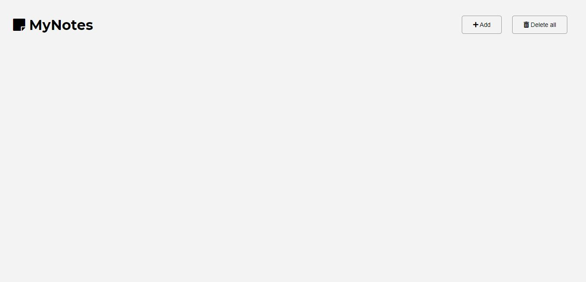

# Mynotes 
This is a simple apllication that allows to make short web notes.
User can write the title of the notes, choose the color of each notes, delete all notes (or each of them),
or edit every note (this aspect needs to be improved). 

* [General info](#general-info)
* [Technologies](#technologies)
* [Screenshots](#screenshots)
* [Setup](#setup)
* [Status](#status)
* [Inspiration](#inspiration)

## General info
I made this project to practice my skills related to JavaScript and web creating. 

## Technologies
Project is created with:
* HTML5
* CSS3
* JavaScript

## Screenshots

## Setup
You can see this project on-line using link: https://szymonsauer.github.io/notes-app-js/.
To run this project locally download the code and run in the Visual Studio Code program. 

## Status
Project is uncompleted - field related to note-edition should be corrected. 

